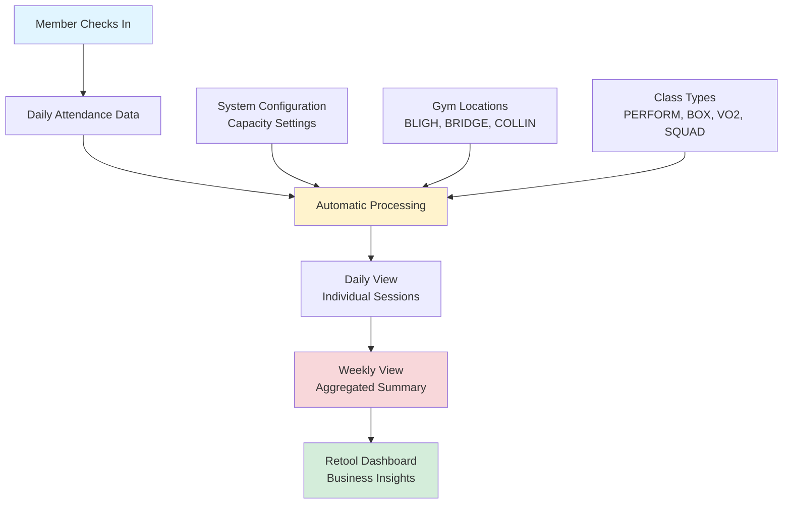
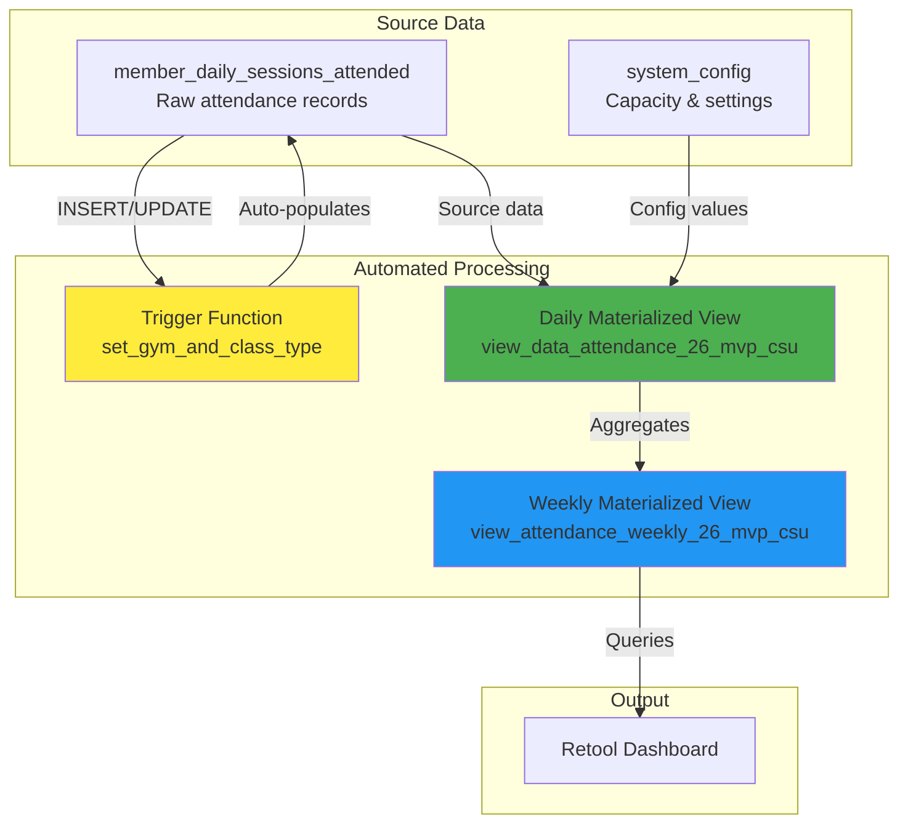

# Attendance Tracking System

## 📊 Overview

These materialized views are designed to provide both sales and operations teams with insights into member attendance patterns, enabling informed decision-making around selling new memberships and capacity expansion opportunities.

**Live Dashboard:** [View Attendance Dashboard](https://lockeroomgym.retool.com/embedded/public/c5016a63-5e65-4265-88bd-5fc97296761b)

*Materialized views are pre-computed database tables that store the results of complex queries. Unlike regular views that calculate data on-the-fly, materialized views store the data physically, allowing for much faster query performance. The data in these views is refreshed automatically via a scheduled cron job (every Tuesday at 1:00 AM), so data will not update until the refresh automation runs.*

---

## 🔄 How Data Flows



### Data Sources

1. **`member_daily_sessions_attended`**: Daily upload via CSV for the previous day's attendance data
2. **`system_config`**: Supabase table storing capacity limits and calculation parameters used in all calculations
3. **Gym Information**: Each class is automatically tagged with its location (BLIGH, BRIDGE, or COLLIN) on each upload via trigger function
4. **Class Types**: Classes are automatically categorized (PERFORM, BOX, VO2, SQUAD) on each upload via trigger function


---

## 📈 Key Metrics Explained

### Daily View Columns (`view_data_attendance_26_mvp_csu`)

#### `session_date`, `session_start`, `session_type`
- **Source:** `member_daily_sessions_attended` table
- **Description:** Date, time, and full name of the class session

#### `gym`
- **Source:** Auto-populated by trigger function from `session_name` in `member_daily_sessions_attended`
- **Description:** Gym location (BLIGH, BRIDGE, or COLLIN)
- **Extraction Logic:** Pattern matching on `session_name` for "BRIDGE"/"BRG", "BLIGH"/"BLH", "COLLIN"/"COL"

#### `class_type`
- **Source:** Auto-populated by trigger function from `session_name` in `member_daily_sessions_attended`
- **Description:** Class category (PERFORM, BOX, VO2, SQUAD)
- **Extraction Logic:** Pattern matching on `session_name` for class type keywords

#### `coaches`
- **Source:** Aggregated from `coach_name` in `member_daily_sessions_attended`
- **Description:** Comma-separated list of all coaches for the session
- **Calculation:** `STRING_AGG(DISTINCT coach_name, ', ' ORDER BY coach_name)`

#### `members_attended`
- **Source:** Aggregated from `member_name` in `member_daily_sessions_attended`
- **Description:** Comma-separated list of all members who attended
- **Calculation:** `STRING_AGG(DISTINCT member_name, ', ' ORDER BY member_name)`

#### `actual_attendance`
- **Source:** Counted from `member_daily_sessions_attended`
- **Description:** Total number of members who attended the session
- **Calculation:** `COUNT(*)` grouped by session

#### `class_type_capacity`
- **Source:** `system_config.capacity` table, joined on `match_pattern = class_type`
- **Description:** Base capacity per class type (e.g., PERFORM = 2)
- **Calculation:** `MAX(sc.capacity)::int` where `sc.match_pattern = class_type`

#### `class_instance_capacity`
- **Source:** Calculated from `class_type_capacity` and number of coaches
- **Description:** Total capacity for this specific session instance (base capacity × number of coaches)
- **Calculation:** `class_type_capacity × (number_of_coaches)`
- **Coach Count:** Derived from counting distinct coaches in the aggregated `coaches` string

#### `max_class_type_capacity`
- **Source:** `system_config` table columns `max_bligh`, `max_bridge`, or `max_collin`
- **Description:** Gym-specific maximum capacity for this class type
- **Calculation:** 
  ```sql
  CASE 
      WHEN gym = 'BLIGH' THEN max_bligh
      WHEN gym = 'BRIDGE' THEN max_bridge
      WHEN gym = 'COLLIN' THEN max_collin
      ELSE capacity
  END
  ```
- **Source Table:** `system_config` joined on `match_pattern = class_type`

---

### Weekly View Columns (`view_attendance_weekly_26_mvp_csu`)

#### `week_start`
- **Source:** Calculated from `session_date` in daily view
- **Description:** First day (Monday) of the week
- **Calculation:** `DATE_TRUNC('week', session_date)::date`

#### `session_type`, `session_start`, `gym`, `class_type`
- **Source:** Passed through from daily view
- **Description:** Same as daily view, aggregated at weekly level

#### `class_type_capacity`
- **Source:** Passed through from daily view (originally from `system_config.capacity`)
- **Description:** Base capacity per class type
- **Calculation:** `MAX(class_type_capacity)` from daily view

#### `class_instance_capacity`
- **Source:** Passed through from daily view
- **Description:** Capacity for the session instance (base × coaches)
- **Calculation:** `MAX(class_instance_capacity)` from daily view

#### `max_class_type_capacity`
- **Source:** Passed through from daily view (originally from `system_config.max_bligh/bridge/collin`)
- **Description:** Gym-specific maximum capacity
- **Calculation:** `MAX(max_class_type_capacity)` from daily view

#### `total_capacity_for_week`
- **Source:** Calculated from `class_instance_capacity` and `operational_days`
- **Description:** Total number of spots available across all operational days in the week
- **Calculation:** `class_instance_capacity × operational_days`
- **Formula:** `MAX(class_instance_capacity) × COUNT(DISTINCT session_date)`

#### `average_spots`
- **Source:** Calculated from `total_capacity_for_week` and `operational_days`
- **Description:** Average number of spots available per operational day
- **Calculation:** `total_capacity_for_week ÷ operational_days`
- **Formula:** `(class_instance_capacity × operational_days) ÷ operational_days`
- **Simplified:** `class_instance_capacity` (since capacity is constant per day)

#### `operational_days`
- **Source:** Counted from `session_date` in daily view
- **Description:** Number of days the class ran during the week (Monday-Friday only)
- **Calculation:** `COUNT(DISTINCT session_date)` where `EXTRACT(DOW FROM session_date) BETWEEN 1 AND 5`
- **Filter:** Only includes weekdays (Monday = 1, Friday = 5)

#### `total_attendance_for_week`
- **Source:** Summed from `actual_attendance` in daily view
- **Description:** Total number of members who attended across all sessions in the week
- **Calculation:** `SUM(actual_attendance)` from daily view

#### `avg_attendance_per_session`
- **Source:** Calculated from `total_attendance_for_week` and session count
- **Description:** Average number of attendees per individual session
- **Calculation:** `AVG(actual_attendance)` from daily view
- **Alternative:** `total_attendance_for_week ÷ number_of_sessions`

#### `utilization_rate`
- **Source:** Calculated from `total_attendance_for_week` and `total_capacity_for_week`
- **Description:** Ratio of actual attendance to available capacity (decimal format, 0.0 = empty, 1.0 = full capacity, >1.0 = over capacity)
- **Calculation:** `total_attendance_for_week ÷ total_capacity_for_week`
- **Formula:** `SUM(actual_attendance) ÷ (class_instance_capacity × operational_days)`
- **Range:** 0.0 to 1.0+ (can exceed 1.0 if over capacity)

#### `sale_without_change`
- **Source:** Calculated using `lc_buffer` and `avg_perform_consumption` from `system_config`, plus `utilization_rate` and `average_spots`
- **Description:** Estimated number of additional members that could be added without changing the current capacity setup
- **Calculation:** `((lc_buffer - utilization_rate) × average_spots) ÷ avg_perform_consumption`
- **Formula Breakdown:**
  - `lc_buffer`: Sourced from `system_config.config_value` where `config_key = 'lc_buffer'` (typically 0.9)
  - `utilization_rate`: Calculated column (see above)
  - `average_spots`: Calculated column (see above)
  - `avg_perform_consumption`: Sourced from `system_config.config_value` where `config_key = 'avg_perform_consumption'` (typically 0.4)
- **Logic:** Calculates available capacity buffer (target utilization minus current utilization) multiplied by average spots, then divided by consumption rate
- **Can be negative:** If `utilization_rate > lc_buffer`, result will be negative (over capacity)

#### `sale_add_change`
- **Source:** Calculated from `sale_without_change` and `max_class_type_capacity`
- **Description:** Estimated number of additional members that could be added if capacity is increased to the gym-specific maximum
- **Calculation:** `sale_without_change + max_class_type_capacity`
- **Formula:** `((lc_buffer - utilization_rate) × average_spots) ÷ avg_perform_consumption + max_class_type_capacity`
- **Source Columns:**
  - `sale_without_change`: Calculated column (see above)
  - `max_class_type_capacity`: Passed from daily view (originally from `system_config.max_bligh/bridge/collin`)
- **Note:** This is the only formula that uses the `max_class_type_capacity` column

---

> **Note:** Capacity calculations currently do not account for class 'staggering' (overlapping class times where members may attend multiple sessions). This needs to be addressed in future iterations to provide more accurate capacity expansion recommendations.

## 🔧 Technical Documentation

### System Architecture



### Database Tables

#### `member_daily_sessions_attended`
Primary source table containing individual attendance records.

**Key Columns:**
- `session_date` - Date of the class
- `session_start` - Class start time
- `session_name` - Full class name (e.g., "PERFORM - BRG AM")
- `member_name` - Name of attending member
- `coach_name` - Name of coach
- `gym` - Auto-populated: BLIGH, BRIDGE, or COLLIN
- `class_type` - Auto-populated: PERFORM, BOX, VO2, or SQUAD

#### `system_config`
Configuration table storing capacity limits and calculation parameters.

**Key Configuration Values:**
- `capacity` - Base capacity per class type (e.g., PERFORM = 2)
- `max_bligh`, `max_bridge`, `max_collin` - Maximum capacity per gym location
- `lc_buffer` - Load capacity buffer (0.9 = 90% target)
- `avg_perform_consumption` - Average consumption rate for calculations (0.4)

### Materialized Views

#### `view_data_attendance_26_mvp_csu` (Daily Detail)
Pre-aggregated daily view showing each session with:
- Aggregated member and coach lists
- Actual attendance count
- Class type capacity (base capacity from config)
- Class instance capacity (base × number of coaches)
- Maximum class type capacity (gym-specific max)

**Refresh:** Daily (or on-demand)

#### `view_attendance_weekly_26_mvp_csu` (Weekly Aggregate)
Weekly summary aggregating Monday-Friday sessions:

**Columns:**
- `week_start` - First day of the week
- `session_type` - Class name
- `session_start` - Class time
- `gym` - Location
- `class_type` - Category
- `class_type_capacity` - Base capacity
- `class_instance_capacity` - Capacity × coaches
- `max_class_type_capacity` - Gym-specific maximum
- `total_capacity_for_week` - Total spots available for the week
- `average_spots` - Average spots per day
- `operational_days` - Number of days class ran (Mon-Fri)
- `total_attendance_for_week` - Total members attended
- `avg_attendance_per_session` - Average per session
- `utilization_rate` - Ratio of attendance to capacity (0.0-1.0+)
- `sale_without_change` - `((lc_buffer - utilization_rate) × average_spots) / avg_perform_consumption`
- `sale_add_change` - `sale_without_change + max_class_type_capacity`

**Refresh:** Daily (or on-demand)

### Automated Functions

#### `set_gym_and_class_type()`
**Type:** Trigger Function (PL/pgSQL)  
**Trigger:** `trigger_set_gym_and_class_type`  
**When:** Before INSERT or UPDATE on `member_daily_sessions_attended`

**Purpose:** Automatically extracts gym location and class type from `session_name`:
- **Gym Detection:** Looks for "BRIDGE"/"BRG", "BLIGH"/"BLH", "COLLIN"/"COL"
- **Class Type Detection:** Looks for "PERFORM", "BOX", "VO2", "SQUAD"
- **Case Insensitive:** Handles variations in capitalization

**Example:**
- Input: `session_name = "PERFORM - BRG AM"`
- Output: `gym = "BRIDGE"`, `class_type = "PERFORM"`

#### `refresh_view_data_attendance_26_mvp_csu()`
**Type:** Function  
**Purpose:** Refreshes the daily materialized view

#### `refresh_view_attendance_weekly_26_mvp_csu()`
**Type:** Function  
**Purpose:** Refreshes the weekly materialized view

### Calculation Formulas

#### Utilization Rate
```
utilization_rate = total_attendance_for_week / total_capacity_for_week
```
- Range: 0.0 (empty) to 1.0+ (over capacity)
- Example: 15 attendees / 18 capacity = 0.833 (83.3% full)

#### Sale Without Change
```
sale_without_change = ((lc_buffer - utilization_rate) × average_spots) / avg_perform_consumption
```
- Shows how many more members can be added without changing capacity
- Uses buffer (0.9) as target utilization
- Example: ((0.9 - 0.833) × 6.0) / 0.4 = 1.0

#### Sale Add Change
```
sale_add_change = sale_without_change + max_class_type_capacity
```
- Shows potential if capacity is increased to maximum
- Example: 1.0 + 8 = 9.0

### Data Flow Details

1. **Data Entry**: Attendance records are inserted into `member_daily_sessions_attended`
2. **Auto-Enrichment**: Trigger function automatically populates `gym` and `class_type` columns
3. **Daily Aggregation**: Daily view groups sessions by date, time, and location
4. **Weekly Aggregation**: Weekly view aggregates Monday-Friday data by week
5. **Configuration Lookup**: Views join with `system_config` to get capacity settings
6. **Calculation**: All metrics are calculated in real-time during view refresh

### Refresh Schedule

**Automated:** Weekly on Tuesday at 1:00 AM
- Cron job name: `refresh_attendance_views_weekly`
- Refreshes both daily and weekly views automatically
- Can also be triggered manually via Retool

**Manual Refresh:**
```sql
SELECT refresh_view_data_attendance_26_mvp_csu();
SELECT refresh_view_attendance_weekly_26_mvp_csu();
```

### Indexes

**Daily View:**
- `idx_daily_attendance_date` on `session_date DESC`
- `idx_daily_attendance_composite` on `(session_date DESC, session_start, session_type)`

**Weekly View:**
- `idx_weekly_attendance_week_start` on `week_start DESC`
- `idx_weekly_attendance_session_type` on `session_type`
- `idx_weekly_attendance_composite` on `(week_start DESC, session_type, session_start)`

### Filtering Logic

**Weekly View Filter:**
- Only includes Monday-Friday: `EXTRACT(DOW FROM session_date) BETWEEN 1 AND 5`
- Groups by week using `DATE_TRUNC('week', session_date)`
- Currently filters for PERFORM classes only (can be expanded)

### Error Handling

- **Division by Zero**: All division operations check for zero denominators
- **NULL Values**: Config values are checked for NULL before use
- **Missing Data**: Views handle missing gym/class_type gracefully (returns NULL)

---

## 📝 Usage in Retool

### Primary Table Query
Use the weekly view as your main dashboard table:

```sql
SELECT 
    week_start,
    session_type,
    session_start,
    gym,
    class_type,
    utilization_rate,
    sale_without_change,
    sale_add_change
FROM view_attendance_weekly_26_mvp_csu
ORDER BY week_start DESC, session_start;
```

### Drill-Down Query
When clicking a weekly row, show daily details:

```sql
SELECT 
    session_date,
    session_start,
    session_type,
    coaches,
    members_attended,
    actual_attendance
FROM view_data_attendance_26_mvp_csu
WHERE DATE_TRUNC('week', session_date) = {{ table1.selectedRow.data.week_start }}
  AND session_type = {{ table1.selectedRow.data.session_type }}
  AND session_start = {{ table1.selectedRow.data.session_start }}
ORDER BY session_date, session_start;
```

See `retool_queries.md` for complete query examples.

---

## 🔄 Maintenance

### Adding New Class Types
1. Update `system_config` with new `capacity` and `max_*` values
2. Update trigger function `set_gym_and_class_type()` to recognize new patterns
3. Refresh views

### Adding New Gyms
1. Add new `max_*` columns to `system_config` if needed
2. Update trigger function to recognize new gym patterns
3. Update weekly view `CASE` statement for capacity selection
4. Refresh views

### Modifying Calculations
1. Update the relevant materialized view definition
2. Drop and recreate the view
3. Refresh the view to populate new calculations

---

## 📞 Support

For questions or issues:
1. Check the Retool queries documentation (`retool_queries.md`)
2. Verify view refresh status
3. Check `system_config` values are correct
4. Review trigger function logic for data enrichment

---

## 📅 Version History

- **v1.0** - Initial implementation with daily and weekly views
- **v1.1** - Added `gym` and `class_type` auto-population via trigger
- **v1.2** - Added gym-specific maximum capacity columns
- **v1.3** - Added `sale_without_change` and `sale_add_change` calculations
